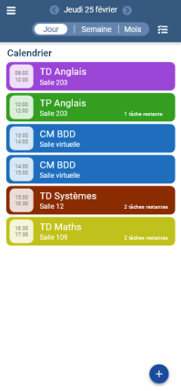
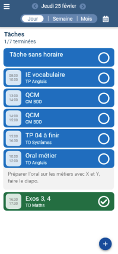
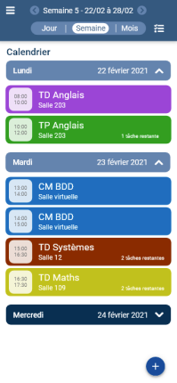
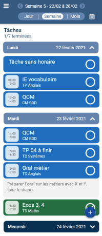

<!-- PROJECT LOGO -->
 

  <h3 align="center">Calendar App</h3>
  

    <a href="#">View Demo (TODO)</a>
  

<!-- TABLE OF CONTENTS -->

  
Table of Contents

  <ol>
    <li><a href="#about-the-project">About The Project</a></li>
    <li><a href="#context">Context</a></li>
    <li><a href="#built-with">Built With</a></li>
    <li><a href="#documentation">Documentation</a></li>
    <li><a href="#acknowledgments">Acknowledgments</a></li>
  </ol>

<!-- ABOUT THE PROJECT -->
## About The Project

  
  
  
  

 

This project is a mobile app for **Android** and **iOS** to allow students to view their schedule and create tasks to easily keep track of their assignments.

### Features

- [x] Check your schedule:  
  - In daily, weekly, monthly.
  - Subject title, time and room are displayed.
- [x] Import a schedule:  
  - An exported file in [iCalendar](https://icalendar.org/) standard format.
- [x] Consult your task list.
  - In daily, weekly, monthly.
  - Can be related to a class session in the schedule.
- [x] Add tasks.
  - Task title, related class session, start and end date and time.
  - Repetition modes: never, on a specific day and time (e.g. every Monday at 8am), or on a related class session (e.g. at every math class).

(<a href="#top">back to top</a>)

<!-- CONTEXT -->
## Context

This project is an academic project realized during the **second year** in the **University and Technological Institute (IUT)** of Computer Science.

(<a href="#top">back to top</a>)

## Built With

- [Xamarin](https://docs.microsoft.com/xamarin/get-started/what-is-xamarin)
- [.NET framework](https://docs.microsoft.com/dotnet/)

(<a href="#top">back to top</a>)

<!-- DOCUMENTATION -->
## Documentation

You can find documentation files such as technical details in the folder `docs/`.

(<a href="#top">back to top</a>)

<!-- ACKNOWLEDGMENTS -->
## Acknowledgments

* [iCal.NET](https://github.com/rianjs/ical.net) library to import iCalendar files.

(<a href="#top">back to top</a>)

